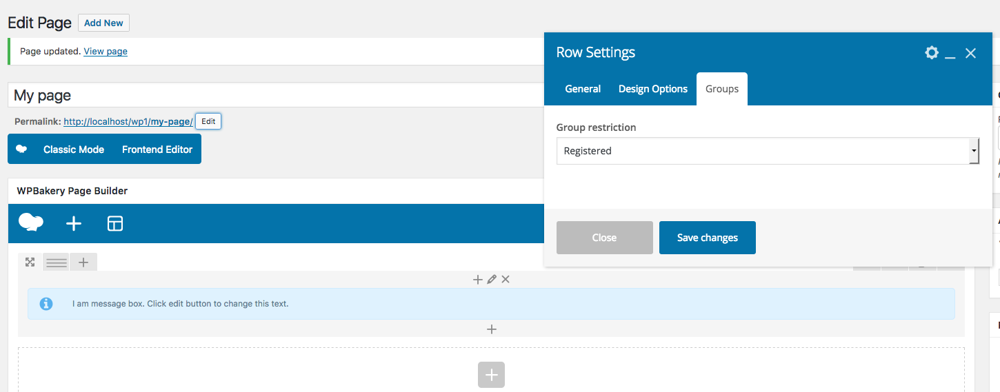

# groups-vc
Groups Visual Composer integration.

The plugin adds a new attribute to the 'row' Visual Composer element.

## Installation
- Install and activate the plugin
- Create a new folder "vc_templates" in your theme or child-theme.
- Copy vc_row.php from /wp-content/plugins/js_composer/includes/templates/shortcodes/ to your newly created folder.

Using the Groups API in this new vc_row.php file you can restrict the content according to the group selected.
In the repository you have an example of vc_row.php file.

The Groups API code used is:
```php
$is_a_member = Groups_User_Group::read( get_current_user_id() , $ix_groups );
if ( ( trim( $ix_groups ) == '' ) || $is_a_member ) {
   ....
}
```


